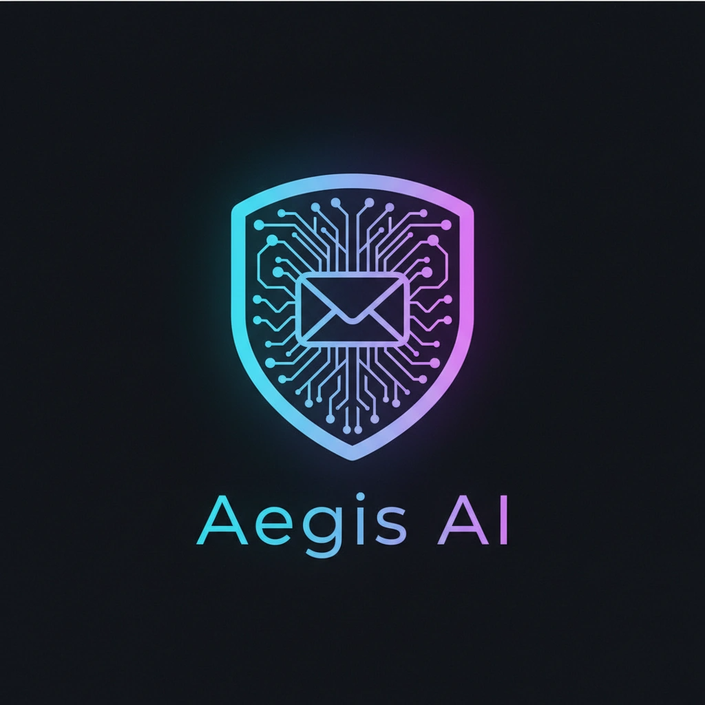



🛡️ Aegis AI — Executive Email Intelligence Agent

Aegis AI is a real-time email intelligence agent that transforms inboxes into actionable insights.

Built by CodeDodona, Aegis reads, classifies, and prioritizes incoming emails, delivering voice-based briefings through an AI avatar.

This project explores the next step in AI evolution:
👉 from passive tools → to active operational agents

🤖 The Agent
🛡️ Aegis — Executive Email Guardian
Monitors incoming emails in real time
Classifies urgency and intent
Summarizes key information
Delivers voice briefings via avatar
Supports decision-making and prioritization

Tone:

Clear
Direct
Operational
⚙️ Architecture
LiveKit → real-time communication
Hedra → avatar rendering
LLM Processing → email classification & summarization
Node.js / Python → backend orchestration
SQL Server → data & credit tracking
Solana → wallet-based access & tokenized usage
🔀 Agent Model

Aegis operates as a task-specific agent within the CodeDodona ecosystem.

Focused on email intelligence
Deterministic behavior (no random responses)
Designed for real-world operational workflows
🧪 What This Repo Contains

This is a public demo subset of the Aegis AI system.

Included:

Demo logic for email classification
Agent orchestration layer
Avatar interaction flow

Not included:

Full email integrations (IMAP / Gmail / Outlook)
Token billing infrastructure
CRM integrations
Production deployment setup
🎥 Demo

https://vimeo.com/1180490784

🚀 Use Cases
Executive email management
Call center operations
CRM-integrated AI assistants
Real-time business notifications
🌐 CodeDodona Platform

Aegis AI is part of CodeDodona, a multi-agent AI platform where users:

Connect via wallet (Solana)
Consume credits to interact with agents
Access both text and real-time voice/avatar AI

Agents are:

specialized
modular
scalable across domains
🧠 Vision

Email is not the problem.
Signal detection is.

Aegis AI turns communication into:

prioritized insight
real-time awareness
actionable intelligence
🏁 Hackathon Participation

This project is submitted to:

Solana Frontier Hackathon
👤 Author

Yannis Thanassekos
Founder — CodeDodona
https://codedodona.com

⚠️ Disclaimer

This repository represents a partial implementation of a commercial system developed for enterprise use.
Certain components are excluded for security and proprietary reasons.